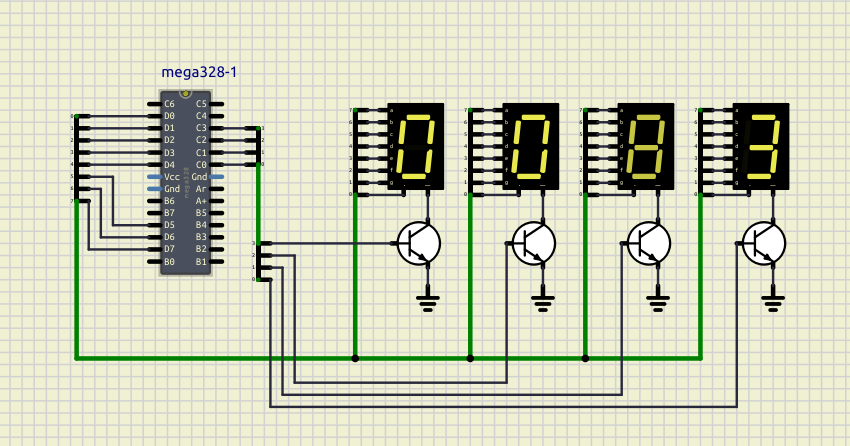

# AVR - 4 digit, 7-Segment Display

---



> 📹 [Watch Demo Video](./assets/video.mp4)

## 7-Segment Display Lookup Table

### Bit Order: `a=bit7, b=bit6, c=bit5, d=bit4, e=bit3, f=bit2, g=bit1, dp=bit0`

```
     _
    |_|
    |_| .
```

| Char | Hex  | a | b | c | d | e | f | g | dp | Segments ON      |
|------|------|---|---|---|---|---|---|---|----|------------------|
| 0    | 0xFC | 1 | 1 | 1 | 1 | 1 | 1 | 0 | 0  | a b c d e f      |
| 1    | 0x60 | 0 | 1 | 1 | 0 | 0 | 0 | 0 | 0  | b c              |
| 2    | 0xDA | 1 | 1 | 0 | 1 | 1 | 0 | 1 | 0  | a b d e g        |
| 3    | 0xF2 | 1 | 1 | 1 | 1 | 0 | 0 | 1 | 0  | a b c d g        |
| 4    | 0x66 | 0 | 1 | 1 | 0 | 0 | 1 | 1 | 0  | b c f g          |
| 5    | 0xB6 | 1 | 0 | 1 | 1 | 0 | 1 | 1 | 0  | a c d f g        |
| 6    | 0xBE | 1 | 0 | 1 | 1 | 1 | 1 | 1 | 0  | a c d e f g      |
| 7    | 0xE0 | 1 | 1 | 1 | 0 | 0 | 0 | 0 | 0  | a b c            |
| 8    | 0xFE | 1 | 1 | 1 | 1 | 1 | 1 | 1 | 0  | a b c d e f g    |
| 9    | 0xF6 | 1 | 1 | 1 | 1 | 0 | 1 | 1 | 0  | a b c d f g      |
| A    | 0xEE | 1 | 1 | 1 | 0 | 1 | 1 | 1 | 0  | a b c e f g      |
| b    | 0x3E | 0 | 0 | 1 | 1 | 1 | 1 | 1 | 0  | c d e f g        |
| C    | 0x9C | 1 | 0 | 0 | 1 | 1 | 1 | 0 | 0  | a d e f          |
| d    | 0x7A | 0 | 1 | 1 | 1 | 1 | 0 | 1 | 0  | b c d e g        |
| E    | 0x9E | 1 | 0 | 0 | 1 | 1 | 1 | 1 | 0  | a d e f g        |
| F    | 0x8E | 1 | 0 | 0 | 0 | 1 | 1 | 1 | 0  | a e f g          |

### Notes
- **dp = 0** (dot OFF) for all entries by default
- To turn the dot ON: `OR` the value with `0x01`
  - Example: `0xFC | 0x01 = 0xFD` → displays `0.`
- Common anode display: **invert all bits** before sending
  - Example: `~seg7[0]` for common anode `0`


This project demonstrates how to build and program a simple LED blink application for the ATmega328P using **C**.

---

## Project Structure

- `src/`: Contains the C source code (`main.c`).
- `build/`: Build artifacts for the C version.
- `tests/`: Logical tests.
- `ssd.sim1`: SimulIDE simulation.

## How to Build

```bash
make    # Builds into build/
```
This creates the `build/` folder containing `main.hex`, `main.elf`, `main.lss`, `main.sym`, and `main.map`.

## How to Program

To flash the hex file to your microcontroller (using `usbasp` by default):
```bash
make program
```

## Clean Up

To remove all build artifacts:
```bash
make clean
```

## Debugging Files

- **`.lss`**: Extended listing file (C source interleaved with disassembly).
- **`.sym`**: Symbol table (Shows all functions and variables with their addresses).
- **`.map`**: Memory map (Shows exactly how much memory each section uses).
- **`.elf`**: Full executable with debugging information.
- **`.hex`**: Raw machine code for flashing.
